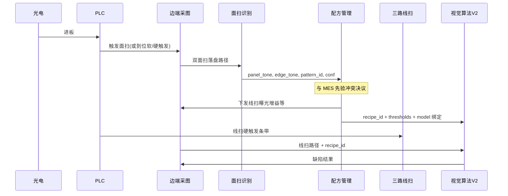

# 关联文档

| 类型 | 文档路径 |
|:---|:---|
| 原始需求 | `scanly/doc/01-or/【面扫】材质花纹色系识别与配方适配.md` |
| 硬件 BOM | `scanly/doc/00-客户资料/鲲鹭-木板封边检测物料清单.xlsx` |
| 软件设计（现有） | `scanly/doc/00-客户资料/板材封边缺陷智能检测设备【厦门四期】项目_软件设计说明书V2.0版本.docx` |
| 白皮书 | `scanly/doc/00-客户资料/20260204 板材封边智能检测设备白皮书（V1.1.2）.docx` |
| 关联设计 | `scanly/doc/02-dr/视觉算法/视觉算法架构V2.md` |
| 测试设计 | `scanly/doc/03-tr/视觉算法/面扫材质色系识别与配方适配测试设计.md` |

# 面扫材质花纹色系识别与配方适配设计

## 1. 功能设计

### 1.1 定位

两台**面扫**工作在进板**冷路径**：识别材质/花纹/色系并决议 `recipe_id`，下发线扫成像参数，并装载检测模型与判定阈值。三台**线扫**仍是缺陷热路径主检（见架构 V2），不因面扫做跨路缺陷融合。

### 1.2 硬件映射（物料清单）

| 角色 | 数量 | 典型型号（BOM） | 配套 | 本模块职责 |
|:---|:---:|:---|:---|:---|
| 面扫 A | 1 | MV-CS004-11GC（或表中 MV-GE34GC-T-CL） | 镜头如 MVL-MF1224M-5MPE / LA1220A | 板饰面色系与花纹 |
| 面扫 B | 1 | 同上 | 同上 | 对位面：另一饰面或封边带可见面 |
| 线扫 上/中/下 | 3 | MV-CL024-91GM（或 MV-GELM41M-T2） | FA3516A 等 + 线扫光源 | 配方生效后的缺陷检测 |
| 边端 IPC / GPU | 1 | 清单工控机 + 显卡 | 千兆网卡等 | 面扫分类 + 线扫 V2 共机部署 |

> 实装位姿以现场台架为准；软件约定 `area_cam_id = panel | edge_or_opposite`，不强绑机械手坐标。

### 1.3 业务流程



**时序约束**：`recipe_ready` 必须在本板首条线扫 `InferRequest` 之前置位；面扫总预算 ≤ 200 ms（识别+决议+参数写相机，不含等板机械延时）。

### 1.4 识别内容

| 输出字段 | 取值 | 说明 |
|:---|:---|:---|
| `panel_tone` | 枚举，初版 `light`/`dark`；**可扩展** | 板面明度等色系档；档位数随迭代可增 |
| `edge_tone` | 枚举，初版 `light`/`dark`；**可扩展** | 封边带（或对位对比面）色系档 |
| `pattern_id` | string | 花纹/材质/反光等粗类；**扩展配方的主标签源** |
| `feature_vector` / 扩展字段 | object | 可选，留给后续算法特征，不进缺陷 det |
| `confidence` | 0~1 | 综合或逐字段置信度 |
| `source` | `area` / `mes` / `fallback` | 最终决议来源 |

**算法选型（建议）**：

- P0：颜色空间 + 亮度/饱和直方图 + 纹理能量（LBP/边缘密度）规则特征；双相机结果经 **RecipeMap** 合成 `recipe_id`。
- P1：轻量分类网络输出 tone / pattern（及未来新增标签）；映射表可配置，**不硬编码 4 类上限**。
- 不在线扫条带路径内跑面扫重模型。

### 1.5 配方集合（可扩展，不锁 4 套）

**原则**：`recipe_id` 是唯一枢纽；每条配方绑定一整套适配参数包。**配方数量 N ≥ 1，不固定为 4**。客户软件既有「四分色」作为**兼容起点**，正式套数在算法迭代中按「样本可分性 + 检出收益 + 维护成本」确认后写入配置资产。

**初版/兼容表**（可与客户默认四方案对齐，可随时被扩表取代）：

| `recipe_id`（示例） | panel_tone | edge_tone | pattern 条件 | 绑定资产（示例） |
|:---|:---|:---|:---|:---|
| `LL` | light | light | * | model/exposure/threshold 包 |
| `LD` | light | dark | * | 同上 |
| `DD` | dark | dark | * | 同上 |
| `DL` | dark | light | * | 同上 |

**扩展示例**（迭代期按需启用，非承诺交付清单）：

| `recipe_id` | 触发条件示例 | 意图 |
|:---|:---|:---|
| `LL_woodgrain` | light×light + pattern=wood_fine | 细木纹假阳性更严阈值 |
| `DD_highgloss` | dark×dark + 高反光 | 曝光更低、残胶阈值调整 |
| `custom_*` | mes_keys / 任意 pattern 集合 | 现场另存 |

**RecipeMap（映射）**：

```text
(area features | MES hint) → match rules → recipe_id → { model_set, exposure_profile, threshold_profile, score_gate, ... }
```

- 规则表配置化（YAML/JSON/工程方案扩展），热加载或换批重启均可。  
- 多规则命中时：优先级字段 + conf；均未命中 → `fallback_recipe_id` 并告警。  
- **禁止**在代码中写死「仅存在 LL/LD/DD/DL」分支；默认实现遍历配方表。

### 1.6 曝光等成像参数适配

边端采图模块持有 **ExposureProfile**（按 `recipe_id`）：

| 项 | 作用对象 | 说明 |
|:---|:---|:---|
| `exposure_us` | 每路线扫 +（可选）面扫 | 写入相机 SDK |
| `gain_db` | 同上 | 增益 |
| `light_level` | 光源控制器（若边端可控） | 可选；否则仅记录人工侧挡位 |
| `line_rate` 等 | 线扫 | 仅在方案差异需要时改，默认继承全局 |

切换流程：决议 `recipe_id` → 若与当前相机参数不一致 → SDK 写参 → 可选丢弃切换后第一帧 → 置 `recipe_ready`。

**边界**：硬触发时序仍由 PLC；本模块只改**电平类曝光参数**，不改触发源配置。

### 1.7 检测算法与阈值适配

| 绑定项 | 消费者 | 内容 |
|:---|:---|:---|
| `model_set` | V2 服务 | 该色系 det + cls 权重路径/版本；仅驻留当前组 |
| `thresholds` | V2 判定 | 各类缺陷 W/L/面积物理阈值；可与白皮书默认表叠加配方偏置 |
| `roi_hint` | 可选 | 不同色系 ROI 微调；默认继承工程 ROI |
| `score_gate` | 可选 | det/cls 置信度门限按色系调整（深板纹理假阳更紧/更松） |

`InferRequest` 必填 `recipe_id`；`thresholds` 由边端按配方展开后下发（或仅下 `recipe_id` 由 V2 查表，二选一并固定一种：

- **推荐**：边端展开 `thresholds` 写入请求，V2 无状态易复现；同时带 `recipe_id` 选模型。

### 1.8 MES / 先验冲突

| 规则 ID | 条件 | 行为（默认） |
|:---|:---|:---|
| R1 | 面扫 conf ≥ `conf_min` | 采用面扫映射 `recipe_id` |
| R2 | 面扫 conf < `conf_min`，MES 有有效色系 | 采用 MES 映射，告警 |
| R3 | 面扫 conf 高且与 MES 强制字段冲突 | 默认采用面扫 + **告警入历史**；可配置为停检 |
| R4 | 双源皆无 | `fallback_recipe_id` 或同批次上一板方案；必告警 |
| R5 | 面扫掉线 | 同 R2/R4 |

所有决议写审计字段：`board_id, panel_tone, edge_tone, recipe_id, source, conf, mes_hint, ts`。

## 2. 数据模型（逻辑，无 DB 外键）

### 2.1 Recipe 表（配置文件或边端工程方案扩展）

| 字段 | 类型 | 说明 |
|:---|:---|:---|
| `recipe_id` | string | 主键语义；全集动态配置 |
| `name` | string | 显示名 |
| `match` | object | 规则：tone/pattern/mes_keys/priority；初版可用 tone 组合兼容四分色 |
| `panel_tone` / `edge_tone` | enum? | 可选；仅当 match 用到时填 |
| `pattern_ids` | string[] | 可选 |
| `model_set_id` | string | 指向 det/cls；可多配方共用同一权重 |
| `exposure_profile_id` | string | 可共用或一对一 |
| `threshold_profile_id` | string | 可共用或一对一 |
| `enabled` | bool | 停用配方不参与匹配 |
| `locked` | bool | 可选；兼容种子方案「仅另存」策略，**不表示总数锁 4** |

### 2.2 ExposureProfile

| 字段 | 说明 |
|:---|:---|
| `line_cam[up|mid|down].exposure_us / gain_db` | 线扫 |
| `area_cam[panel|edge].exposure_us / gain_db` | 面扫 |

### 2.3 ThresholdProfile

与架构 V2 §5.2 同结构，按缺陷类存储 `min_w_mm` / `min_l_mm` / `min_area_mm2` / `detect_is_ng` 等；配方可在默认表上叠加相对偏置（如深板胶缝 `min_w_mm *= 1.0` 保持，划伤略放宽等——具体数值现场标定）。

### 2.4 AreaInferRequest / AreaInferResponse（边端 ↔ 面扫服务）

**Request**：`board_id`，`image_paths[{area_cam_id, path}]`，可选 `mes_hint`。  
**Response**：§1.4 输出字段 + 建议 `recipe_id`（未做 MES 决议前）。

边端 **RecipeResolver** 完成 R1–R5 后产出最终 `recipe_id` 与展开后的 `thresholds`。

## 3. 模块边界

| 模块 | 负责 | 不负责 |
|:---|:---|:---|
| 边端面扫采图 | SDK 触发/取流/落盘、写曝光 | 缺陷框 |
| 面扫识别服务 | 读路径、特征/分类、输出 tone/pattern | 写相机、PLC |
| 边端 RecipeResolver | 冲突决议、写线扫参、装载方案 | 条带 det |
| V2 缺陷服务 | 按 `recipe_id`/`thresholds` 检测判定 | 面扫分类 |

可与 V2 **同进程不同口** 或 **独立轻量进程**；独立进程时接口同为本地 gRPC/HTTP + 文件路径。

## 4. 约束与边界

1. 面扫不做 0.2 mm 胶缝主检；不能删除 3 线扫。
2. 热路径禁止「等双面扫齐套超过预算」；超时走降级。
3. 仅驻留当前 `model_set`，切换时允许短时重载（计入非条带时间）。
4. 不改 MES HTTP、贴标 TCP 协议字段；扩展字段仅落在边端内部与 V2。
5. Scope Out：自动学习新花纹并写回训练；跨板全局聚类；机构升降（厚度仍走 PLC）。

## 5. 落地分期

| 阶段 | 内容 | 退出标准 |
|:---|:---|:---|
| **A0** | 配置驱动的 Recipe 表 + Exposure/Threshold/Model 绑定（**初版可只装 4 条兼容种子**）；MES 或手动选 recipe | 任意启用配方可解释切换；线扫在对应曝光下可检 |
| **A1** | 面扫规则/轻量 cls；RecipeResolver；写曝光 + 传 thresholds | 进板自动切**当前启用全集**；时延达标 |
| **A2** | 冲突策略、审计；按迭代结果**增删/合并配方**，确认 N 与特征维度 | 告警链路与误切指标可验收；**N 与映射规则文档化** |

**N 的确认准则（实现期）**：新增一套须至少满足——有效样本够训/够标定、相对合并方案有可测收益（漏/误报或成像稳定性）、维护成本可接受；否则合并入邻近 recipe 或仅拆阈值/曝光而不拆模型。

## 6. 与架构 V2 的接口衔接

扩展 `InferRequest`（在 V2 §6.2 基础上）：

| 字段 | 类型 | 说明 |
|:---|:---|:---|
| `recipe_id` | string | **必填**；来自面扫决议或 MES/降级；**任意已注册 id**，非枚举四值 |
| `recipe_source` | string | `area` / `mes` / `fallback`，审计用 |
| `area_meta` | object | 可选：识别特征快照（tone/pattern/conf 及扩展字段） |
| `thresholds` | object | 由配方展开；空则 V2 按 `recipe_id` 查配置表 |

V2 行为：

1. 按 `recipe_id` 热加载/命中缓存的 det+cls 权重（可多 id 共享权重文件）。  
2. 使用请求内 `thresholds` 做物理判定。  
3. 不复检面扫图像；`frames`/`image_paths` 仍只含线扫 up/mid/down。  
4. 未知 `recipe_id` → 明确错误/降级，禁止静默用默认表。

## 7. 结论

物料清单中的 **2 面扫** 构成「材质-花纹-色系感知 → 配方」冷路径；**3 线扫**在适配后的曝光与阈值下完成热路径缺陷检测。**配方集合可扩展、套数不锁 4**；客户四分色仅为初版兼容种子。`recipe_id` 绑定模型/曝光/阈值资产；MES 作先验与降级，面扫实测优先并可配置冲突策略。最终方案粒度在算法迭代中按实现程度确认。
