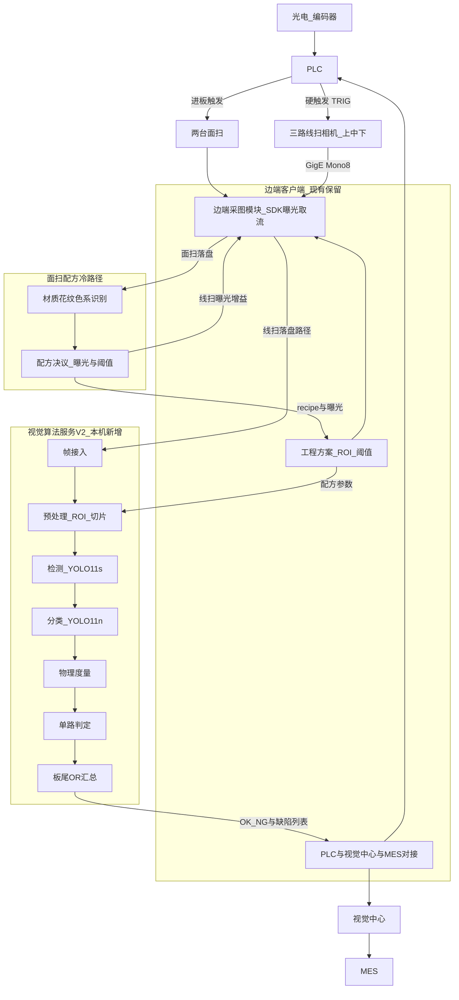
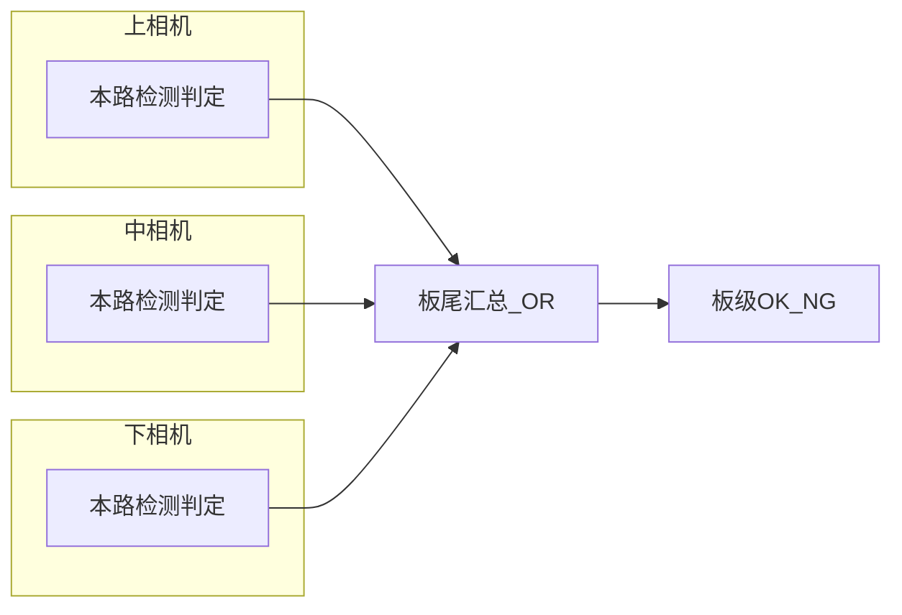
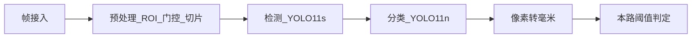

# 板材封边缺陷视觉算法架构 V2（客户简版）

**文档用途**：向客户说明已确认的架构设计结果。  
**对应详细设计**：《视觉算法架构 V2》（内部完整版）。  
**定位**：在现有边端客户端 / 视觉中心 / PLC / MES 体系上，升级边端 AI 检测算法；不改造 MES、贴标与出料中控协议。

---

## 1. 设计目标

| 项 | 设计结果 |
|:---|:---|
| 线速 | 最高 60 m/min |
| 像素精度 | 约 0.03 mm 量级（以现场标定为准） |
| 检出目标 | 板级缺陷检出率 ≥99%（验收口径以合同为准） |
| 软件边界 | 保留现有边端 UI、视觉中心、PLC、MES；仅替换边端「AI 推理」步骤 |
| 硬件策略 | 先沿用现场原硬件复原功能（**2 面扫 + 3 线扫**，见物料清单）；稳定后再评估优化降本 |
| 色系适配 | 进板面扫识别材质/花纹/色系，映射到**可扩展配方集**（初版兼容浅/深板×浅/深边等），联动曝光与判定阈值；**最终套数算法迭代确认** |
| 异常策略 | 算法服务不可用时，边端回退原模型槽位，产线不停线 |

---

## 2. 总体架构

算法以**边端同机推理服务**部署；边端通过本地接口提交**图像文件路径**与配方参数，算法读盘推理后回传结果（现阶段**不使用共享内存**）。  
**算法侧 OS 优先 Ubuntu**；若现场原系统非 Linux 且切换成本过高，可沿用原 OS。

| 层级 | 模块 | 职责 |
|:---|:---|:---|
| 电气 | 光电、编码器、PLC | 产生硬触发，决定曝光时刻 |
| 成像-面扫 | 2 台面扫相机 | 进板采集饰面/对照面，供色系与花纹识别（非毫米级缺陷主检） |
| 成像-线扫 | 3 路线扫相机 | 按 TRIG 曝光，输出 Mono8，缺陷主检 |
| 边端现有 | 采图模块 + UI + 通讯 | 相机参数与取流；**图像落盘**；**按配方写曝光**；业务交互；结果外发 |
| 边端新增 | 面扫识别 + 配方决议 + 视觉算法服务 V2 | 色系→方案；按路径读线扫图做缺陷检测 / 分类 / 度量 / 判定 |
| 产线上层 | 视觉中心、MES | 多机汇总、复检、业务数据（协议不变）；色系先验可校核面扫 |

---

## 3. 采图与硬触发（谁配合曝光）

线扫需上位机配置曝光，并与硬触发配合取流。职责划分如下：

| 环节 | 负责方 | 设计结果 |
|:---|:---|:---|
| 曝光、增益、行频、触发模式（硬触发 / Line） | **边端客户端采图模块**（相机 SDK，如海康 MVS） | 在工程方案中配置并下发到相机 |
| 硬触发脉冲 | **PLC → 相机 TRIG** | 板材到位后按电气时序曝光；量产不使用软件软触发 |
| 取流、组帧、缓冲 | **边端客户端采图模块** | 连续采集模式下接收条带/帧 |
| 图像落盘 | **边端客户端** | 写入本机约定目录，按板/相机命名 |
| 算法输入 | 边端 → V2 | **本机文件绝对路径** + 板材/配方参数（暂不共享内存） |
| V2 | **帧接入适配** | 按路径读文件并校验；不打开相机、不发送触发 |

结论：硬触发图像获取由**边端采图模块 + PLC 硬触发**完成；边端落盘后算法**本地文件访问**读图，双方进程解耦。

---

## 4. 三路相机策略

| 项 | 设计结果 |
|:---|:---|
| 运行方式 | 上 / 中 / 下三路**独立检测、独立判定**（各跑各的） |
| 板级结论 | 任一路 NG → 板 NG；缺陷列表按路拼接；计数按路相加 |
| 跨相机融合 | **不做**框级同步融合与跨路等待 |

| 相机 | 主检内容 |
|:---|:---|
| 上 | 上棱胶缝、上表面划伤/压痕、残胶、波浪纹；端头过长/短带（上缘可见） |
| 中 | 侧面低于/高于饰面、开胶、封边带损伤、崩缺 |
| 下 | 下棱胶缝、下表面伤、残胶；端头过长/短带（下缘可见） |

---

## 5. 单路算法流程

边端送入本路图像后，V2 单路处理顺序如下；板材离开检测区后，对三路结果做 OR / 计数汇总，回传边端。

| 模型 | 规格 | 作用 |
|:---|:---|:---|
| 检测 | YOLO11s，输入默认 640 | 定位缺陷区域 |
| 分类 | YOLO11n-cls，裁剪约 224 | 细分类与误报抑制 |
| 加速 | TensorRT FP16 | 边端实时推理 |
| 配方 | **配置化 N 套**（可多方案共享 det+cls 权重）；初版可装客户既有四分色兼容种子 | 按 `recipe_id` 加载参数包；**套数不锁死为 4**，迭代中确认 |

---

## 6. 缺陷判定（默认阈值，可配置）

| 缺陷 | 默认条件（mm） |
|:---|:---|
| 胶缝 | 宽 >0.2 且 长 >5 |
| 侧面低于饰面 | 高 >0.3 且 长 >5 |
| 短带 | 长 >1 |
| 过长 | 长 >1 |
| 划伤/压痕 | 宽 >0.4 且 长 >5 |
| 残胶 | 宽 >1 且 长 >3 |
| 开胶 | 宽 >1 且 长 >5（可配置为检出即 NG） |
| 崩缺 | 宽 >1 且 长 >1 |
| 封边带损伤 | 宽 >1 且 长 >1 |
| 波浪纹 | 宽 >0.7 |

阈值由工程方案下发，支持现场调整。

---

## 7. 接口摘要

**边端 → V2**：板材 ID、机台号、**配方 ID（面扫/MES 决议）**、可选面扫色系快照、**三路线扫图像本机路径**、ROI、标定（mm/px）、**按配方展开的判定阈值**。

**V2 → 边端**：

| 字段 | 说明 |
|:---|:---|
| `board_ok` | 板级 OK / NG |
| `defects[]` | 类别、相机位、框、宽/长/面积（mm）、置信度 |
| `counts` | 各类计数 |
| `engine` | `scanly-v2` |

边端再按原协议写入 PLC、上报视觉中心。面扫帧仅供色系识别，**不作为缺陷 det 输入**。

---

## 8. 硬件配置与性能

**策略**：先沿用原现场/设计说明书/物料清单硬件完成功能复原与联调；不以换硬件为上线前提。功能达标后，再单独评估 GPU/工控机降本（如 3060）。

| 类别 | 原配置基线（建议沿用） |
|:---|:---|
| 面扫相机 | 2×（如 MV-CS004-11GC），进板色系/花纹识别 |
| 线扫相机 | 3× MV-CL024-91GM（上/中/下），硬触发，Mono8 |
| 触发 | 编码器 + 光电 → PLC → TRIG（线扫）；进板触发面扫 |
| 边端工控 | i7 级 + 16GB 起 + SSD；原机型（如 HC-SYSA35II 等） |
| 边端 GPU | **RTX 2080 Ti**（现场/原方案常用，现阶段主用） |
| 算法 OS | **优先 Ubuntu**；原系统非 Linux 且切换成本高时可沿用 |
| 图像传递 | **本机落盘 + 文件路径**（现阶段）；不做共享内存 |
| 视觉中心 | 汇总/复检主机，不跑 V2 推理 |
| 配方路径时延 | 面扫识别 + 方案切换目标 ≤200 ms（不含机械等待） |
| 单路算法目标 | ≤23 ms 量级（不含采图；盘 IO 另计运维缓冲） |

---

## 9. 实施阶段

| 阶段 | 交付内容 |
|:---|:---|
| 一阶段（原硬件复原） | 在既有相机/工控机/2080 Ti 等配置上：单路检测+分类+度量；边端对接与回退；基础样本就绪；手动/MES 选配方（初版可用兼容种子） |
| 二阶段（三路与配方） | 三路独立并行；板尾 OR；**配置化**模型与阈值绑定；与视觉中心对齐 |
| 二点五阶段（面扫自适应） | 双面扫识别 → 自动配方、曝光与阈值；**支持扩展多套**；冲突告警与降级 |
| 三阶段（达标与优化评估） | 线速验收与难例回流；**确认最终配方粒度/套数**；可选硬件降本 |

---

## 10. 样本收集与标注支撑

算法检出率与稳定性依赖现场真实样本。训练、验证、**多配方适配**、**面扫色系/花纹分类**及持续迭代均需双方协同完成样本收集与标注，为本交付的必要支撑条件。

| 类别 | 要求 |
|:---|:---|
| 缺陷类型 | 覆盖约定缺陷（胶缝、侧面高低、短带/过长、划伤、残胶、开胶、崩缺、封边带损伤、波浪纹等） |
| 色系配方 | **当前启用配方全集**均需代表性样本（不限四分色）；**面扫双视角样图同步留存** |
| 相机视角 | 上 / 中 / 下三路 + 两面扫均需采集并可区分 |
| 规模建议 | 每类有效缺陷框建议 ≥1000 量级（极明显类可酌减） |
| 负样本 / 难例 | 正常板面与易误报场景；试运行漏检误检持续回流补标 |

| 事项 | 甲方（客户/现场） | 乙方（算法方） |
|:---|:---|:---|
| 产线采图 | 提供采图条件或授权存图，覆盖配方与班次 | 提出采集清单与质量要求 |
| 缺陷真值 | 工艺/质检确认；协助难例收集 | 类别体系与标注规范 |
| 标注 | 安排或委托标注；参与抽检与口径确认 | 工具/规范、质检与清洗 |
| 迭代 | 持续提供漏检误检回流 | 补训与版本发布 |

---

*本简版与《视觉算法架构 V2》详细设计结论一致。面扫配方细节见同目录《01.面扫材质色系识别与配方适配》。对外 Word 说明书见同目录《板材封边缺陷视觉算法架构说明书V2.docx》（图件更新后重导）。*

