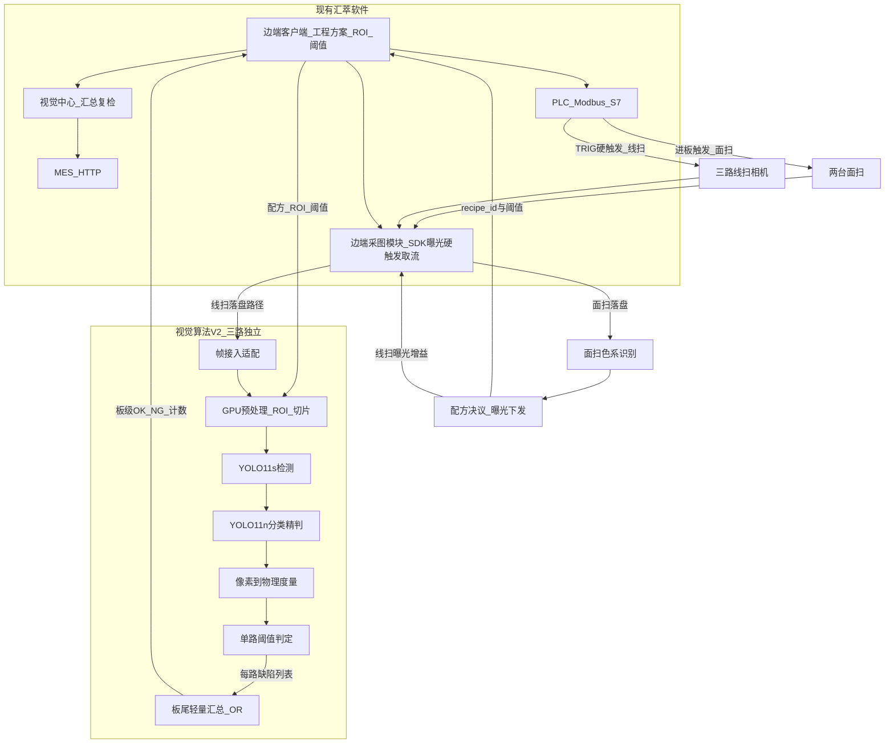
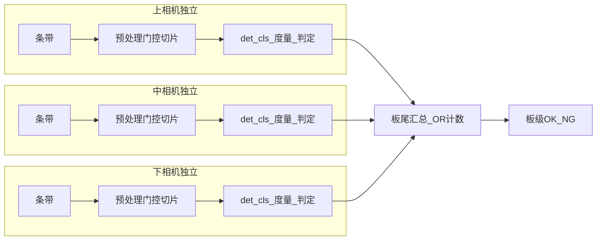

# 关联文档

| 类型 | 文档路径 |
|:---|:---|
| 客户白皮书 | `scanly/doc/00-客户资料/20260204 板材封边智能检测设备白皮书（V1.1.2）.docx` |
| 软件设计（现有） | `scanly/doc/00-客户资料/板材封边缺陷智能检测设备【厦门四期】项目_软件设计说明书V2.0版本.docx` |
| 硬件 BOM | `scanly/doc/00-客户资料/鲲鹭-木板封边检测物料清单.xlsx` |
| 节拍/算力笔记 | `scanly/doc/00-客户资料/需求分析.md` |
| 视觉链路笔记 | `scanly/doc/00-客户资料/图像处理.md` |
| 标注格式 | `scanly/doc/00-客户资料/sample-format.md` |
| 原始需求 | `scanly/doc/01-or/【面扫】材质花纹色系识别与配方适配.md` |
| 类别角色 | `scanly/doc/01-or/【缺陷类别】核心缺陷与屏蔽非缺陷.md` |
| 关联设计 | `scanly/doc/02-dr/视觉算法/01.面扫材质色系识别与配方适配.md` |
| 测试设计 | `scanly/doc/03-tr/视觉算法/面扫材质色系识别与配方适配测试设计.md` |
| 数据工具 | `scanly/defects/tools/convert.py` |
| 客户简版 | `scanly/doc/02-dr/视觉算法/视觉算法架构V2-客户简版.md` |
| 客户 Word 说明书 | `scanly/doc/02-dr/视觉算法/板材封边缺陷视觉算法架构说明书V2.docx` |

# 板材封边缺陷视觉算法架构 V2

## 1. 目标与边界

### 1.1 目标

1. 在现有产线硬件与汇萃软件骨架上，将算法层从「配方绑定的 AI 黑盒 + 面积/长度阈值」升级为「检测 → 分类精判 → 物理度量 → 可配置判定」，三路相机**各自独立完成判定**。
2. 支撑白皮书能力目标：线速最高 **60 m/min**、像素精度约 **0.03 mm** 量级、板级缺陷检出率 **≥99%**（含漏检/误检口径以客户验收为准）。
3. 与厦门四期现有边端客户端、视觉中心、PLC、MES **协议级兼容**，算法升级不迫使中心复检/贴标/MES 改造。
4. **硬件策略**：先沿用现场/厦门四期**原硬件配置**复原功能；功能与检出稳定后，再评估优化降本（含 GPU）。不以换卡为上线前置。
5. **性能约束**：三路线扫**各跑各的**，热路径不做跨相机结果同步与融合；板级 OK/NG 仅在板尾做轻量汇总（见 §4.2）。

### 1.2 融合原则

- **保留**：边端 UI（工程方案 / ROI / 算子参数）、**边端采图（SDK 曝光与硬触发取流）**、视觉中心汇总与复检、PLC（Modbus TCP / S7）、MES（HTTP）、加密狗与部署拓扑。
- **替换**：边端内「AI 模型推理 + 后处理过滤」步骤，改为调用本 V2 视觉推理服务。
- **降级**：V2 进程不可用时，边端回退到原模型槽位推理，保证产线不停线。

### 1.3 Scope Out

- 不重做 MES、贴标路径、出料中控 TCP、加密狗 UI。
- **不接管**相机 SDK 主控与硬触发发送（见 §3.1）。
- 不以更换相机型号、不以更换 GPU 为功能上线前置条件（先原硬件复原）。
- 本文件为架构方案，不含训练超参与源码实现。

---

## 2. 现状摘要（V1 等效）

| 维度 | 现状 | 对 V2 的含义 |
|:---|:---|:---|
| 硬件 | 每台封边机 **2× 面扫**（色系/花纹）+ **3× 线扫**（上/中/下，如 MV-CL024-91GM）+ 编码器硬触发 + GPU 工控机（见 BOM） | 缺陷热路径仍三路线扫独立帧流；面扫走进板冷路径（见 `01.面扫…`） |
| 软件 | 边端 ×2~4 + 视觉中心；客户有四分色工程方案作兼容起点 | V2 按**可扩展** `recipe_id` 选模型与阈值；配方可由**面扫识别**和/或 MES 决议；**N 不锁 4**（见 `01.面扫…`） |
| 算法 | 黑盒检测 + 面积/长度阈值；无正式度量与多视角融合 | V2 采用 YOLO11s det + YOLO11n cls + 度量；三路独立判定 |
| 本仓库 | 13 类 YOLO bbox 标注 + `convert.py`；无在线推理 | V2 推理以该类别与数据管线为训练入口 |

现场软件设计书速度口径约 **0.48 m/s**，白皮书与内部分析目标为 **60 m/min**；V2 性能预算按 **60 m/min** 设计，现场可按配置降速验证。

---

## 3. 系统定位：相对现有软件

面扫识别与配方决议详见 `01.面扫材质色系识别与配方适配.md`；**缺陷 det/cls 输入仅为三路线扫帧**。

**部署形态（固定）**：

- 算法为边端同机（或同网段本机盘可见）**独立服务**；边端经 **本地 gRPC / HTTP** 提交任务（元数据 + 图像文件路径），算法读盘推理后回传结果。
- **图像传递（现阶段）**：**硬盘落盘 + 本地文件路径**，**暂不使用**共享内存。边端采图写文件 → 告之路经 → V2 打开文件；更解耦、易联调与复盘。
- **操作系统**：**算法模块优先 Ubuntu Linux**（驱动、CUDA/TensorRT 与部署习惯）。若现场边端现为 Windows 且切 Linux 成本过高，**可沿用 Windows**，算法服务与边端同 OS 部署；后续再评估拆机/容器化。
- **现阶段沿用原现场 GPU（如 2080 Ti）**；三路共用模型权重量调度按相机隔离。

### 3.1 采图与硬触发职责划分（固定）

线扫需上位机配置曝光与触发模式，硬触发脉冲来自电气侧。软件采图归属如下；V2 **不接管**相机 SDK 主控。

| 环节 | 负责模块 | 做什么 |
|:---|:---|:---|
| 曝光、增益、行频、触发源=Line 等 | **边端客户端采图模块**（海康 MVS / GenICam） | 工程方案配置并下发相机；配方切换时可改曝光 |
| 硬触发脉冲 | **光电 → PLC → 相机 TRIG_IN** | 决定曝光时刻；禁止量产用软件软触发 |
| 取流、组帧、缓冲 | **边端客户端采图模块** | Continuous + 硬触发下接收 Mono8 条带/帧 |
| 帧落盘 | **边端客户端** | 写本机目录（如按 board_id / camera_id 命名的 bmp/png）；清理策略由边端或运维约定 |
| 帧交给算法 | 边端 → V2 | gRPC/HTTP 携带 **文件绝对路径** + `camera_id` / `board_id` 等元数据 |
| 帧接入 | **V2 帧接入适配** | 按路径读文件、校验格式、入每路队列；不打开相机、不发 TRIG |

详细设计中的「帧接入」指 **V2 按路径读已落盘图像**，不是替代汇萃采图。若未来改为共享内存/零拷贝，单独立项。

---

## 4. 边端单板算法流水线

| 步骤 | 职责 | 约束 |
|:---|:---|:---|
| 1. 帧接入 | 按边端给出的**本机图像路径**读盘；上/中/下**三路独立队列** | 不控制相机 SDK；**现阶段不走共享内存**；三路不互等齐套 |
| 2. 预处理 | GPU 上 CLAHE / 归一化 / 封边条 ROI 裁剪 | CPU 不做重预处理 |
| 3. 空窗门控 | 方差/边缘能量过低的切片直接跳过 | 降低 3060 无效推理占比 |
| 4. 切片 | 滑动窗口默认 **1024×1024**，重叠可配 | 应对约 0.2×5 mm 级小目标 |
| 5. 检测 | **YOLO11s-detect** | TensorRT FP16；按配方切换权重 |
| 6. 分类 | **YOLO11n-cls** 对候选框裁剪精判 | 仅对 det 框推理 |
| 7. 度量 | 像素 → mm（本路标定） | 输出宽、长、面积 |
| 8. 单路判定 | 本路阈值 → 本路 OK/NG + 缺陷列表 | **不依赖其他相机** |
| 9. 板尾汇总 | `board_ok = 三路皆 OK`；计数相加；缺陷列表拼接 | **仅 OR/求和，不做跨视角框匹配与同步融合** |

### 4.1 模型选型（YOLO11 + 3060 成本上限）

**结论（固定）**：边端量产采用 **检测 YOLO11s + 分类 YOLO11n** 组合；**不采用** YOLO11m / l / x 作为边端在线模型。

| 角色 | 规格 | 约参数量 | 输入 | 部署 | 职责 |
|:---|:---|:---|:---|:---|
| 主检测 | **YOLO11s** detect | ~9.4M | **640**（默认）；小目标召回不足时升到 **768**，仍不足则加密切片重叠，不升到 m | TensorRT FP16 | 高召回定位；输出候选框 + 粗类（可少于 13 类） |
| 精分类 | **YOLO11n-cls** | ~1.5–3M 量级 | 裁剪框 resize 到 **224**（或 128） | TensorRT FP16 | 映射白皮书/13 类细类；抑制纹理误报 |
| 配方 | **N 套配置化** `det+cls`（可多 id 共享权重）；初版可装 4 条兼容种子 | — | — | 按 `recipe_id` 热加载当前一组 | **套数与标签在算法迭代中确认**；禁止代码写死仅 4 枚举 |

选型依据（相对白皮书节拍与小目标）：

| 规格 | 相对 3060 @640 TRT FP16（量级） | 是否边端量产 |
|:---|:---|:---|
| YOLO11n det | 最快，显存最省 | 仅作「切片密度被迫极高」时的降级档，默认不用（小目标召回偏弱） |
| **YOLO11s det** | 单路约数 ms 级，三相机+门控后可压进节拍 | **默认采用** |
| YOLO11m/l/x | 精度更高，但三相机连续条带+切片易打满 3060 | **禁止边端量产**；仅离线对比实验 |

多模型分工：det 保召回（胶缝等极小目标优先不漏），cls 保精度（残胶/划伤/标签等易混类与假阳）；物理阈值仍在 cls 之后做最终 NG。色系差异主要体现在两组权重，不另开更大 backbone。

### 4.1.1 小参数是否够用（准确度上限）

**结论**：在本场景下，**板级 ≥99% 检出的主要上限通常不在「YOLO11s/n 参数太少」**，而在成像可分性、极小目标有效分辨率、样本覆盖与后处理度量；s+n 两阶段的有效上限高于「单模型再加大一档但被迫少切/漏条带」。

| 常见顾虑 | 实际情况 |
|:---|:---|
| s/n 表达能力不够 | 封边缺陷多为局部纹理/几何异常，特征相对局部；工业 AOI 大量量产系统用 small/nano 级骨干即可，前提是图质稳定、类间可分 |
| 必须上 m/l 才能到 99% | 单测 mAP 往往随模型变大略升，但 3060 上若因此减少切片重叠或丢条带，**板级漏检可能反而变差** |
| n-cls 分不清细类 | 分类看的是已裁剪 ROI，目标占比大，轻量 cls 通常够用；不够时优先加难例/外扩策略，或把易混类合并后再用规则拆，而不是先换大 det |

本方案把「准确度」拆成可独立加高的几层（比盲目加大 backbone 更有效）：

1. **成像与标定**：真实 mm/px、对比度、触发同步——胶缝约 7×172 px，图质不行则任何 YOLO 都抬不高上限。
2. **召回层（YOLO11s）**：切片重叠、输入 640→768、配方分模型、det 粗类高召回；离线用 m 做教师/对比，**不**把 m 部署进边端热路径。
3. **精度层（YOLO11n-cls）**：难例回流、负样本（木纹/反光/标签）、真假缺陷二分类可与细分类并联。
4. **业务层**：物理宽长阈值、几何类（侧面高低）按相机主责判定；板级仅 OR 汇总。

**何时才认为 s 触顶**：在成像与数据已充分、切片/768 已用上的前提下，离线对比 **同数据 YOLO11m 相对 s 的召回仍有不可接受缺口**（例如关键缺陷类漏检差 > 约定阈值），再评估：降线速换 m、或「难例相机/难例 ROI 走二次 det」等局部加重，而不是全链路换成 l/x。

验收口径固定为 **板级检出率**（及约定漏检/误检），不以 COCO 式 mAP 单独作为是否换大模型的依据。

### 4.2 三路相机：业务是否要融合？

**结论（固定）**：业务上**不需要**跨相机的同步融合判定；三路按视角**分工独立检**，板级只要 **OR 汇总**。热路径禁止「等三路齐套再融合框」。

#### 业务依据

| 证据 | 含义 |
|:---|:---|
| 硬件/软件把相机摆成上/中/下 | 缺陷按棱、侧面、表面分区成像，主责本就不重叠 |
| 白皮书缺陷多为单视角可判 | 胶缝、侧面高低、表面伤、开胶等各自落在对应相机 |
| PLC/验收要的是板级 OK/NG | 「任一路 NG → 板 NG」即可，不必合并同一缺陷的多视角框 |
| 现有「视觉中心融合」 | 主要是多台封边机边端结果汇总，不是单机三相机算法级融合 |

端头短带/过长：上或下任一检出且超阈值即 NG（逻辑 OR），**不要求**上+下框对齐后再判。计数若偶发重复，对 PLC 无影响；UI 展示可接受按相机会签，不做 IoU 去重。

#### 性能依据

| 做法 | 效果 |
|:---|:---|
| 三路各跑各的 | 无跨路 barrier；条带到达即可推理，GPU 按队列吞吐即可 |
| 板尾 OR 汇总 | O(1) 逻辑，板离开时拼结果，不占条带周期 |
| 若做同步融合 | 必须对齐里程/条带、等最慢一路，尾延迟上升且实现复杂，对检出率无必要收益 |

#### 视角主责（分工，非融合）

| 相机位 | 主责缺陷 | 辅责（本路独立判，不跨路合并） |
|:---|:---|:---|
| 上 | 上棱胶缝、上表面划伤/压痕、残胶、波浪纹 | 端头过长/短带（上缘可见时） |
| 中 | 侧面低于/高于饰面、开胶、封边带损伤、崩缺 | 胶缝侧面可见段 |
| 下 | 下棱胶缝、下表面伤、残胶 | 端头过长/短带（下缘可见时） |

Scope Out：跨视角 IoU 去重、互补投票、同缺陷多相机联合度量——默认不做；仅当现场明确要求「计数去重展示」时，可在板尾做**可选离线整理**，仍不进入条带热路径。

---

## 5. 缺陷体系对齐

**口径**：能力目标以白皮书 10 类为准；现场默认阈值可对齐软件设计书 7 类数值，均通过配置下发，不写死在模型内。det 负责候选召回，**最终中文业务类以 cls 输出为准**（再经物理阈值）。

### 5.1 客户缺陷 ↔ 标注映射

类别角色以 `scanly/doc/02-dr/缺陷训练/03.类别角色核心缺陷与屏蔽.md` 为准。`Hole` / `ResidualTape` / `Zigzag` / `Label` 为**屏蔽非缺陷**，不是崩缺 / 封边带损伤 / 波浪纹。

| 客户缺陷（中文） | 标注 class | 处理策略 |
|:---|:---|:---|
| 封边胶缝 / 胶缝间隙 | GlueSeam, GlueGap | det 召回 + 需度量（宽、长） |
| 侧面低于饰面 | Below | 中路独立；需度量 |
| 侧面高于饰面 | Above（样本极少，方案默认关）；Bumps 为鼓包 | 中路独立 |
| 端头/尾部短带 | Shorter | 上或下本路独立判 |
| 端头过长 | Longer, Longer2 | 上或下本路独立判 |
| 表面划伤/压痕/凹凸 | Scrape（核心）；Scratch 样本极少 | det + 需度量 |
| 残胶 / 夹胶 | GlueResidue, ClampGlue | det（易混）+ 需度量；ClampGlue 方案可默认关 |
| 开胶 | Tackless | det；或「检出即 NG」开关 |
| 崩缺 | GlueGap | det + 需度量；**不是 Hole** |
| 封边带损伤 | BandBroken | det + 需度量；**不是 ResidualTape** |
| 波浪纹 | BandWave | 当前无训练样本；**不是 Zigzag** |
| 残带 / 钻孔 / 锯齿 / 标签 | ResidualTape, Hole, Zigzag, Label | 训练可保留；推理默认屏蔽，不计入板级 NG |

### 5.2 默认判定阈值（可配置，白皮书能力优先）

| 缺陷 | 默认触发条件（宽 × 长，mm） |
|:---|:---|
| 胶缝 | W>0.2 且 L>5 |
| 侧面低于饰面 | H>0.3 且 L>5（现场可改为软件书 H<0.1 等口径） |
| 短带 | L>1 |
| 过长 | L>1 |
| 划伤/压痕 | W>0.4 且 L>5 |
| 残胶 | W>1 且 L>3 |
| 开胶 | W>1 且 L>5（或「检出即 NG」开关） |
| 崩缺 | W>1 且 L>1 |
| 封边带损伤 | W>1 且 L>1 |
| 波浪纹 | W>0.7 |

边端原有「面积 / 长度」算子参数映射为上述物理阈值；像素阈值仅作内部调试，不对操作员暴露。

---

## 6. 与现有软件融合接口（契约）

### 6.1 调用关系

1. 边端完成采图与方案加载后，组装 `InferRequest`，调用 V2。
2. V2 返回 `InferResponse`；边端写 UI 叠加、PLC NG 点、并向视觉中心 TCP 上报（协议不变）。
3. 调用超时或进程失败 → 边端切换原 AI 槽位，并打运维告警。

### 6.2 InferRequest（输入）

| 字段 | 类型 | 说明 |
|:---|:---|:---|
| `board_id` | string | 板材条码/业务 ID |
| `machine_id` | string | 封边机号 |
| `recipe_id` | string | **必填**。工程/适配配方 ID（**任意已注册字符串**，不限于 `LL`/`LD`/`DD`/`DL`）；优先由**面扫识别决议**，MES/降级见面扫设计；N 随迭代扩展 |
| `recipe_source` | string | 可选。`area` / `mes` / `fallback`，审计用 |
| `area_meta` | object | 可选。`panel_tone`/`edge_tone`/`pattern_id`/`confidence`（面扫输出快照） |
| `model_id` | string | 显式模型版本（可空，空则按 recipe 解析） |
| `frames[]` / `image_paths[]` | object | 每项：`camera_id`（**仅** up/mid/down）、`path`；**现阶段以落盘文件为准**；**不含面扫帧** |
| `roi[]` | object | 每相机 ROI（像素）；空则整幅 |
| `thresholds` | object | 各类宽/长/面积阈值；**推荐由边端按配方展开后下发**；空则服务按 `recipe_id` 查默认表 |
| `calib` | object | 每相机 `mm_per_px`（及可选厚度档） |
| `meta` | object | 厚度、编码器里程、时间戳等 |

### 6.3 InferResponse（输出）

| 字段 | 类型 | 说明 |
|:---|:---|:---|
| `board_id` | string | 回显 |
| `board_ok` | bool | 板级 OK=true / NG=false |
| `defects[]` | DefectResult | 见下表 |
| `counts` | map | 各类计数（兼容边端/中心展示） |
| `latency_ms` | object | 预处理/det/cls/单路判定分项（可按 camera_id） |
| `engine` | string | 固定 `"scanly-v2"`，便于中心区分来源 |

**DefectResult**

| 字段 | 说明 |
|:---|:---|
| `class_id` / `class_name` | 以 **cls** 细类为准（13 类英文名 + 可映射中文显示名） |
| `det_score` / `cls_score` | 检测与分类置信度 |
| `camera_id` | up / mid / down |
| `bbox_xyxy` | 像素框 |
| `width_mm` / `length_mm` / `area_mm2` | 物理度量 |
| `decision` | pass / fail（相对阈值） |

边端负责把 `defects` / `counts` / `board_ok` 转成现有 TCP 与 PLC 语义；V2 不直连 PLC/MES。`board_ok` 由三路结果 OR 汇总得出，**不依赖跨相机框级融合**。

---

## 7. 性能与硬件约束

### 7.1 硬件策略（固定）

1. **现阶段**：沿用厦门四期/现场**原硬件配置**做算法接入与功能复原（相机、工控机、RTX 2080 Ti 等）。
2. **不以换硬件为前置**：功能、联调与基础检出先在原配置上跑通。
3. **后续**：功能稳定后再评估**优化降本**（如 RTX 3060 是否满足节拍）；评估不倒逼产线更换设备。

### 7.2 原硬件基线（建议沿用）

| 角色 | 配置（原方案/现场常用，以实机为准） |
|:---|:---|
| 相机 | **2× 面扫**（如 MV-CS004-11GC，色系/花纹）+ **3× 线扫** 海康 MV-CL024-91GM（上/中/下），GigE；线扫硬触发 Mono8（以 BOM/现场实机为准） |
| 镜头/光源 | 面扫/线扫既有镜头与光源控制器；配方切换改曝光/增益，算法不改光学结构 |
| 触发 | 编码器 + 光电 → PLC → 相机 TRIG |
| 边端 IPC | i7 级、16GB 起内存、SSD；原机型如 HC-SYSA35II 等 |
| 边端 GPU | **RTX 2080 Ti**（现阶段主用） |
| 视觉中心 | 汇总/复检主机（不跑 V2） |
| 网络/通讯 | 工业千兆；PLC Modbus TCP/S7；MES HTTP |

### 7.3 节拍预算

| 项 | 数值 |
|:---|:---|
| 线速目标 | 60 m/min（可分档验证） |
| 精度目标 | ≈0.029 mm/px 量级（以现场标定为准） |
| 条带假设 | 1024 行/条带时单相机约 **34 帧/s** 量级 |
| 小目标参考 | 0.2×5 mm 胶缝约 7×172 px |

三路独立队列共享一块 GPU，**不等待**他路同里程结果。减载：封边 ROI + 空窗门控 + YOLO11s@640 + n-cls + TensorRT FP16。

**延迟预算（单路单条带，不含跨路等待；原 2080 Ti 裕度更宽）**：

| 阶段 | 预算 |
|:---|:---|
| 预处理 + 门控 | ≤ 5 ms |
| YOLO11s det | ≤ 12 ms |
| YOLO11n-cls | ≤ 4 ms |
| 度量 + 单路判定 | ≤ 2 ms |
| **单路合计** | **≤ 23 ms** |

板尾 OR 汇总不计条带预算。禁止为融合引入跨路同步点。

### 7.4 链路前置假设

- 硬触发链路：光电 → PLC → 相机 TRIG；边端采图配置触发源与曝光；禁止量产软触发。
- GigE + 工业网卡；Mono8；取流与**落盘**由边端完成，V2 **按文件路径读图**（暂不共享内存）。
- 预处理与 det/cls 均在 GPU（CUDA / TensorRT）。
- **算法 OS**：优先 **Ubuntu**；若沿用原 Windows 边端且迁移成本高，算法可先部署于同一 Windows。

### 7.5 后续降本与传图演进（非 P0 前置）

- 在原硬件达标后，可评估 RTX 3060 等是否满足节拍；不通过则继续沿用原 GPU。
- 传图方式稳定达标后，若落盘 IO 成为瓶颈，再评估共享内存/内存映射，**不作为当前阶段交付约束**。
- 优先算法减载（ROI/门控/切片），不上同步融合、不全链路换成 m/l/x。

---

## 8. 落地分期

| 阶段 | 内容 | 退出标准 |
|:---|:---|:---|
| **P0** | **原硬件**上：单相机 YOLO11s+n-cls+度量；TensorRT；gRPC；基础样本；**手动/MES 选 recipe（初版可用 4 兼容种子）** | 离线指标达标；原机单路条带延迟达标；可回退 |
| **P1** | 三路独立并行；板尾 OR；**配置化**阈值/模型绑定；对接视觉中心 | 三路联调；板级 NG 与复检一致 |
| **P1.5** | **面扫冷路径**：识别 → 配方决议 → 曝光 → thresholds/model（见 `01.面扫…`）；支持扩展 N 套 | 进板自动切**当前启用配方**；时延与冲突策略可验收 |
| **P2** | 门控/切片；难例回流；线速压测；**按迭代确认最终配方粒度/套数**；可选硬件降本 | 第 7 节预算与板级检出达标；N 文档化 |

数据侧：`convert.py` 继续产出 det 训练框；另建裁剪分类集训练 cls。

---

## 9. 风险与约束

| 风险 | 应对 |
|:---|:---|
| 软件书 7 类与白皮书 10 类、标注 13 类不完全一致 | 映射表 + 可配置阈值；细类以 cls 为准 |
| 担心 s/n 算法上限不够 99% | 见 §4.1.1；先成像/切片/数据/两阶段 |
| 误做三路同步融合拖慢节拍 | 见 §4.2；默认独立 + 板尾 OR |
| 过早换硬件影响进度 | 先原配置复原；降本单独立项 |
| 极小目标算力压力 | YOLO11s@640 + ROI/门控；禁 m/l/x 全链路 |
| det 假阳偏多 | cls 精判 + 物理阈值 |
| 4 配方显存压力 | 只驻留**当前** `model_set`；多配方可共享权重；N 增大时评估热切换开销 |
| 配方套数蔓延难维护 | 增套须有可测收益；合并无效细分；N 由迭代确认而非预先锁死 |
| 面扫误判导致整板错模型/曝光 | 置信阈值 + MES 校验 + 审计；误切率现场验收 |
| 面扫阻塞线扫热路径 | 冷路径预算 ≤200 ms；超时降级，禁止静默未知配方 |
| 汇萃客户端接入窗口不确定 | 契约先稳定；边端插件或本地代理 |

---

## 10. 结论

视觉算法 V2 定位为边端推理服务：**采图落盘后按文件路径读图**（暂不共享内存）；**OS 优先 Ubuntu**，迁移动成本高时可与边端同沿用 Windows。**先沿用原现场硬件（含 2080 Ti、BOM 中 2 面扫 + 3 线扫）复原功能**；V2 做 YOLO11s + YOLO11n、三路线扫独立与板尾 OR；**2 面扫负责色系/花纹 → 配方/曝光/阈值适配（冷路径）**。功能稳定后再评估硬件降本与传图优化。按 P0→P1→P1.5→P2 分期交付。
